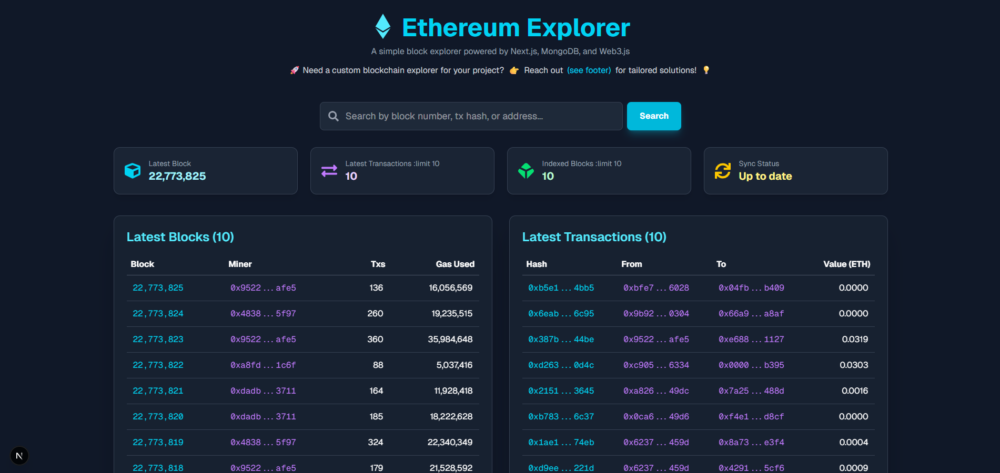
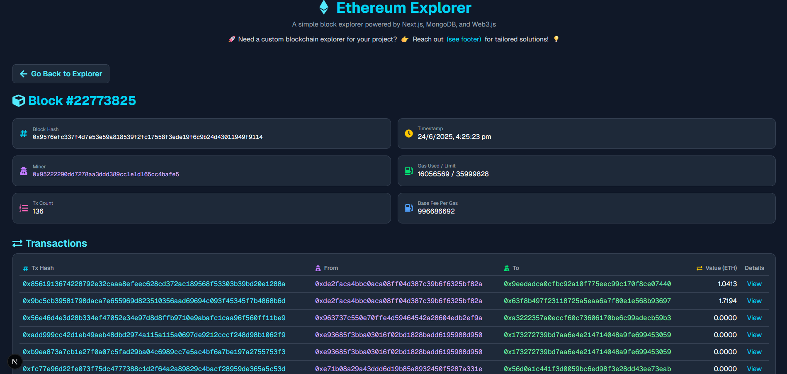
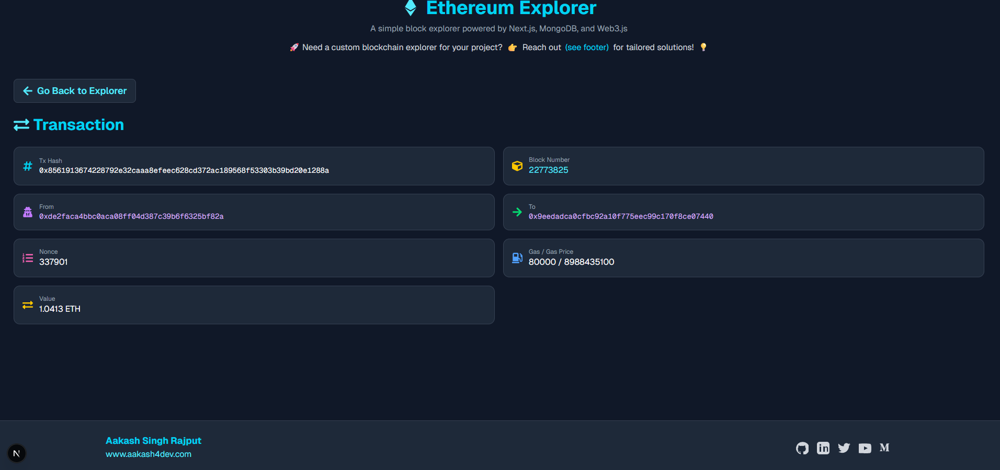

# Ethereum Block Explorer

A functional and clean block explorer for Ethereum, built with Next.js (App Router), MongoDB, and Web3.js.

This project serves as a practical example of how to index data from a blockchain and display it in a user-friendly interface. It indexes the latest blocks and transactions, provides detailed views for each, and includes a searchable interface.

---

### 📸 A Quick Peek!

| Homepage | Block Page | Transaction Page |
| :---: | :---: | :---: |
|  |  |  |

---

## ✨ Features

* **Live Indexing:** Fetches and indexes the 10 most recent Ethereum blocks on startup.
* **Manual Sync:** Includes a "Resync" option to fetch the latest data without deleting existing records.
* **Clean UI:** A straightforward, explorer-style layout.
* **Comprehensive Search:** Search by block number, transaction hash, or wallet address.
* **Detailed Views:** Etherscan-inspired pages for individual blocks and transactions.
* **Reliable Connection:** Uses the public [PublicNode Ethereum RPC](https://ethereum-rpc.publicnode.com) by default.

---

## 🛠️ Tech Stack & Setup

To run this project locally, you will need the following tools.

### 1. Prerequisites

| Tool | Installation Link | Learning Resource |
| :--- | :--- | :--- |
| **Node.js (v18+)** | [Download Node.js](https://nodejs.org/en/download) | [Node.js Guides](https://nodejs.org/en/docs/guides) |
| **MongoDB** | [Download MongoDB Community Server](https://www.mongodb.com/try/download/community) | [MongoDB University](https://learn.mongodb.com/) |
| **Next.js** | _(Installed via npm)_ | [Official Next.js Learn Course](https://nextjs.org/learn) |

### 2. Clone The Repository

```bash
git clone https://github.com/aakash4dev/nextjs-ethereum-explorer.git 
cd nextjs-ethereum-explorer
```

### 3. Install Dependencies

```bash
npm install
npm install react-icons
```

### 4. Configure Environment Variables

Create a `.env.local` file in the project's root directory and add the following:

```env
ETHEREUM_RPC_URL=https://ethereum-rpc.publicnode.com
MONGODB_URI=mongodb://localhost:27017/ethereum_indexer
```

*Note: For production or cloud hosting, replace the local MongoDB URI with your connection string from a service like MongoDB Atlas.*

---

## ▶️ Running the Application

### 1. Start MongoDB

If you are running a local MongoDB server, open a new terminal and start the daemon:

```bash
mongod
```

### 2. Run the Next.js App

```bash
npm run dev
```

The application will be available at [http://localhost:3000](http://localhost:3000).

---

## 👤 About & Contact

<div align="center">
  
</div>

<div align="center">

**Aakash Singh Rajput** Blockchain Developer (Go, Solidity, Rust)

[Website](https://www.aakash4dev.com) | [GitHub](https://github.com/aakash4dev) | [LinkedIn](https://linkedin.com/in/aakash4dev) | [Twitter](https://twitter.com/aakash4dev)

</div>

### Looking for a custom explorer?

This project is built for Ethereum, but the principles can be applied to any EVM-compatible chain or adapted for other blockchains.

**I am available for contract work to build custom indexers and explorers. If you need a solution for a specific blockchain, feel free to get in touch.**

* **Email:** [aakash4dev.me@gmail.com](mailto:aakash4dev.me@gmail.com)

---

## 📝 License

This project is licensed under the MIT License.
Anyone can use this code for any purpose.